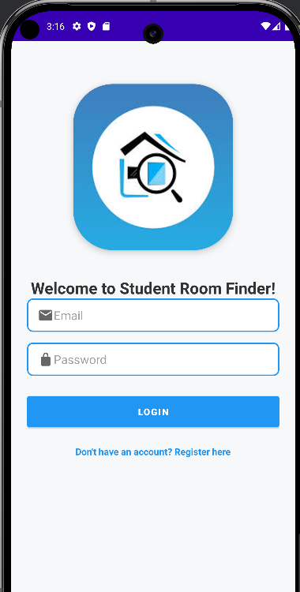

# Student Room Finder

A native Android application designed to help students find suitable accommodation, sharing rooms, and paying guest (PG) options easily. 

## 📱 Features

- **User Authentication**: Secure Login and Registration system.
- **Room Listings Dashboard**: View a list of available rooms with key details like title, rent, location, and images.
- **Search Functionality**: Filter and search for rooms in specific locations (e.g., Akurdi, Nigdi, Chinchwad, Pimpri).
- **Room Details**: Detailed view for individual room listings.
- **Post a Room**: Users can post their own rooms to find roommates or tenants.

## 📸 Screenshots

<p align="center">
  
  
  
  
  
  
  
</p>

## 🛠 Tech Stack & Architecture

- **Language**: Java
- **UI Toolkit**: Android XML Layouts, Material Design, ConstraintLayout
- **Minimum SDK**: 26 (Android 8.0 Oreo)
- **Target SDK**: 35 (Android 15)
- **Components**: 
  - `RecyclerView` with custom `RoomAdapter` for performant list rendering.
  - `SearchView` for real-time location filtering.
  - `SharedPreferences` for local user data management.

## 📂 Project Structure
```text
app/src/main/java/com/example/roomfinder/
├── adapters/
│   └── RoomAdapter.java         # Handles RecyclerView binding
├── models/
│   └── Room.java                # Room Data Model
├── LoginActivity.java           # Handles User Login
├── RegisterActivity.java        # Handles User Registration
├── MainActivity.java            # Main Dashboard & Search
├── PostRoomActivity.java        # Form to post a new room
└── RoomDetailsActivity.java     # Detailed view of a room
```

## 🚀 Getting Started

### Prerequisites
- [Android Studio](https://developer.android.com/studio) (Koala or later recommended)
- Java 11

### Installation
1. Clone this repository:
   ```bash
   git clone https://github.com/kiteflies-ok/Student-Room-Finder.git
   ```
2. Open the project in Android Studio.
3. Sync the Gradle files (`File -> Sync Project with Gradle Files`).
4. Build and run the app on an Android Emulator or a physical device.

## 📝 Note
The application is currently utilizing mock data to showcase the UI and functionality. To transition to a full production app, backend integration (e.g., Firebase, REST API) can be easily plugged into the existing models.
